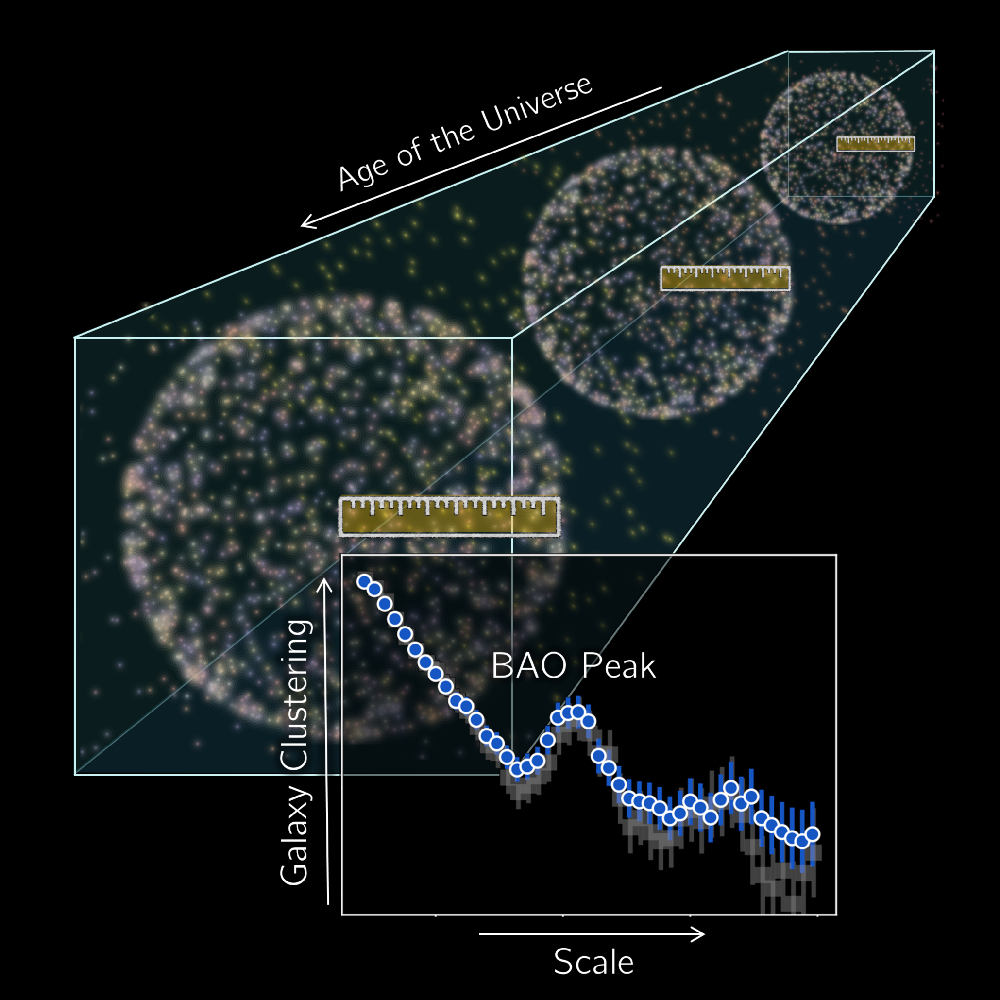

Leinweber Postdoctoral Fellow · University of Michigan

Precision cosmology with large galaxy surveys &middot; cosmic structure &middot; growth-expansion consistency tests

I’m **Uendert Andrade**, a cosmologist using state-of-the-art galaxy surveys to test the standard cosmological model. My work focuses on **large-scale structure**, **galaxy clustering**, **baryon acoustic oscillations (BAO)**, and consistency tests of **gravity** and **dark energy**.

I work across observational and theoretical cosmology, with a particular emphasis on turning survey measurements into robust cosmological constraints. Within **DESI** (Dark Energy Spectroscopic Instrument), I have played leading roles in BAO validation, blinding strategies, and coordination of cosmological results from galaxy and quasar clustering. I am also an active member of **DES** (Dark Energy Survey), where I am leading the Y6 geometry-growth split analysis.

At UMichigan, I work within the **Leinweber Institute for Theoretical Physics** and am part of the [Huterer Research Group](https://websites.umich.edu/~huterer/mygroup.html).

{ .ua-profile-avatar }

Uendert Andrade

Leinweber Postdoctoral Fellow

  Leinweber Institute for Theoretical Physics
  University of Michigan · Ann Arbor
  <a href="mailto:uendsa@umich.edu">uendsa@umich.edu</a>

  <a href="mailto:uendsa@umich.edu">Email</a>
  <a href="https://github.com/Uendert">GitHub</a>

## Featured Work: DESI BAO

BAO constraints from DESI Data Release 2 are the result of a large collaboration effort. My contributions centered on galaxy and quasar BAO validation, blinding tests, analysis coordination, documentation, plots, and writing, as well as leading the dedicated validation paper.

<figure class="ua-bao-figure" markdown="1">
{ .ua-bao-image }
<figcaption>BAO as a standard ruler across cosmic time. Image: C. Lamman/DESI Collaboration, via <a href="https://physics.aps.org/articles/v18/130">APS Physics</a>.</figcaption>
</figure>

-   :material-chart-bell-curve-cumulative: __Main DESI DR2 BAO paper__

    ---

    *DESI DR2 Results II: Measurements of Baryon Acoustic Oscillations and Cosmological Constraints* appeared in *Phys. Rev. D* (2025).

    Credited for DR2 BAO topical-group leadership, Key Project coordination, BAO analysis on mocks and data, unblinding tests and documentation, plots, and writing.

    [Open the PRD paper](https://journals.aps.org/prd/abstract/10.1103/tr6y-kpc6)

-   :material-check-decagram-outline: __Validation paper__

    ---

    *Validation of the DESI DR2 Measurements of Baryon Acoustic Oscillations from Galaxies and Quasars* appeared in *Phys. Rev. D* (2025).

    Led the analysis and writing for the paper validating the galaxy and quasar BAO measurements.

    [Open the validation paper](https://journals.aps.org/prd/abstract/10.1103/kdys-w8vl)

-   :material-newspaper-variant-outline: __Physics Viewpoint__

    ---

    *Rethinking Our Place in the Universe* highlights DESI DR2 BAO results and their implications for dark energy.

    [Read the APS Physics article](https://physics.aps.org/articles/v18/130)

  <a href="research/">Explore research</a>
  <a href="publications/">Browse publications</a>
  <a href="talks/">See talks</a>

