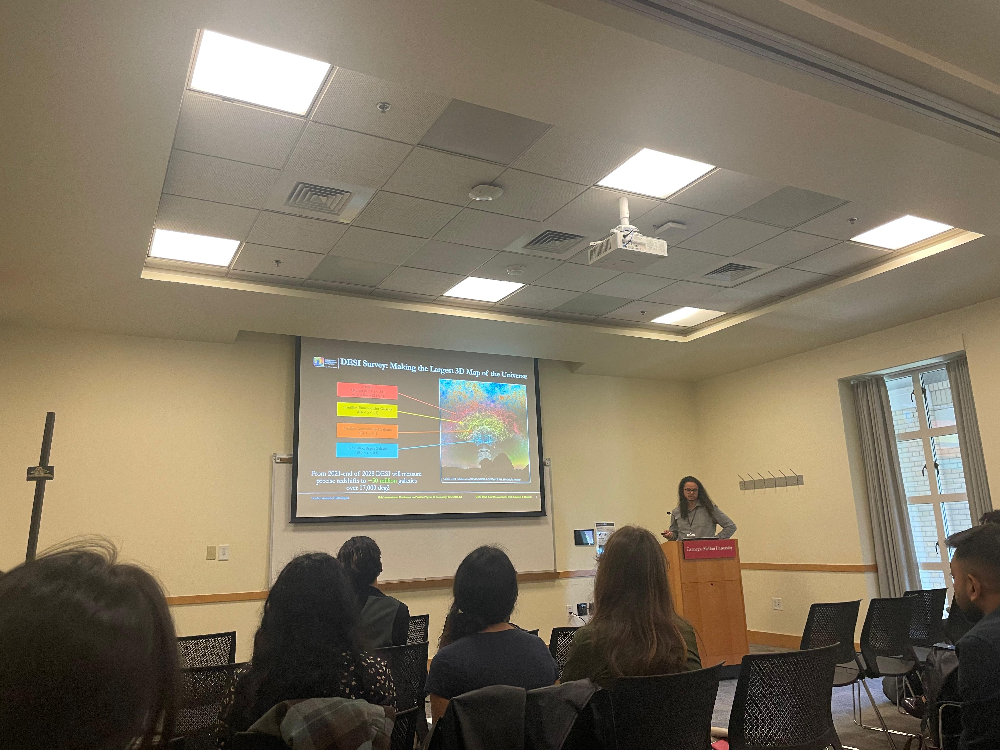

# Talks

Selected invited and conference presentations on DESI, BAO, dark energy, galaxy surveys, and growth-expansion consistency tests. A complete list is available in the PDF version of my CV.

## Invited Talks

  

    
June 2025

    
Madison, WI

    
Plenary

  

  

    
Conference on the Intersections of Particle &amp; Nuclear Physics

    
<em>DESI DR2: New Cosmological Constraints and Challenges to the</em> ΛCDM <em>Model</em>

    

      <a class="ua-talk-link" href="../assets/talks/cipanp-2025-desi-dr2-results.pdf">Slides PDF</a>
    

  

  

    
May 2025

    
Virtual

  

  

    
NASA Cosmic Structure Science Interest Group

    
<em>DESI DR2: Measurements of Baryon Acoustic Oscillations and Cosmological Constraints</em>

  

  

    
April 2025

    
Cornell University

  

  

    
LEPP Journal Club Seminar

    
<em>Cosmological Constraints from DESI: DR1 to latest DR2</em>

  

  

    
February 2025

    
Sexten, Italy

  

  

    
Cosmology on the Steep Rise

    
<em>Cosmology from DESI DR1: Baryon Acoustic Oscillations &amp; Full-Shape Measurements</em>

  

  

    
November 2024

    
The Ohio State University

  

  

    
CCAPP Seminar

    
<em>DES Y6 extensions and growth–geometry split analyses</em>

  

  

    
October 2024

    
Perimeter Institute

  

  

    
Cosmology Meeting, Perimeter Institute for Theoretical Physics

    
<em>Cosmological constraints from DESI DR1</em>

  

  

    
October 2024

    
University of Waterloo

  

  

    
Cosmology Meeting, University of Waterloo

    
<em>An Empirical Consistency Test of Dark Energy Models</em>

  

  

    
August 2024

    
Crete, Greece

  

  

    
XIII International Conference on New Frontiers in Physics

    
<em>Cosmology from the DESI Year 1 Baryon Acoustic Oscillations Measurements</em>

  

  

    
July 2024

    
Marseille, France

    
Plenary

  

  

    
DESI Collaboration Meeting

    
<em>Summary of KP7a Results: Cosmological constraints from DESI DR1 and external data</em>

  

  

    
June 2024

    
Barcelona, Spain

  

  

    
ICCUB Seminar, University of Barcelona

    
<em>Testing the Consistency of Growth and Expansion with the Dark Energy Survey</em>

  

## Contributed Conference Talks

  <figure class="ua-talk-photo">
    
  </figure>
  

    

      
October 2025

      
Pittsburgh, PA

    

    

      
COSMO2025

      
<em>Validation of DESI DR2 Baryon Acoustic Oscillations Measurements</em>

    

  

  

    
August 2024

    
Salvador, Brazil

  

  

    
VII CosmoSul

    
<em>Cosmology from the DESI Year 1 Baryon Acoustic Oscillations Measurements</em>

  

  

    
July 2024

    
Split, Croatia

  

  

    
Cosmology in the Adriatic — From PT to AI

    
<em>DESI Blinding Methodology and Validation</em>

  

  

    
December 2022

    
Cancún, Mexico

  

  

    
VIII Essential Cosmology for the Next Generation

    
<em>A Test of the Standard Cosmological Model with Geometry and Growth</em>

  

  

    
September 2021

    
Virtual

  

  

    
XLI Brazilian National Meeting of Particle and Field Physics

    
<em>A Test of the Standard Cosmological Model with Geometry and Growth</em>

  

  

    
September 2020

    
Virtual

  

  

    
J-PAS Theory Workshop

    
<em>An empirical consistency test of</em> ΛCDM <em>cosmology with J-PAS</em>

  

